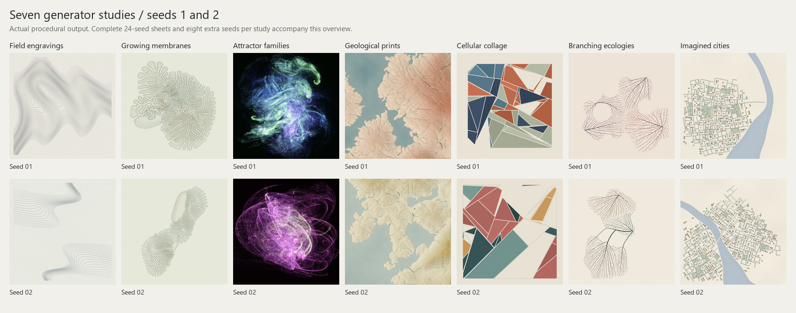

# Seven generator studies: implementation and visual review

**Direction update:** the user's subsequent review accepted only the attractor
direction from this round. The assessments below document the earlier review;
they are not the current creative plan. Continue with the [three minimal Perlin
studies on black](perlin/README.md).

3 October 2026 · `agent/generator-experiments` · code commit [`c43fdf0`](https://github.com/MagnusPetursson/pfb-studio/commit/c43fdf07bf26df0beca657cd0ffa474e340c2cc9)

All seven proposed directions are implemented as runnable, seeded Python studies.
The best immediate visual yield comes from **related attractors**. **Cellular
collage** and **field engravings** offer more distinct directions for further
development. None is being promoted into the native app in this round.

The branch starts from the cleaned optimization candidate at `38995bc`. The five
production generators remain unchanged. See the [runbook](../../experiments/README.md)
for setup, controls, image export, and the native reference renderer, and the
[research brief](../generator-research.md) for the original design reasoning and sources.

This overview uses seeds 1 and 2 for every study. It is not a selection of the best
outputs. The complete sheets below retain every sample, including weak results.

## What was compared

| Set | Seeds per generator | Generators | Images | Rendering |
| --- | --- | --- | --- | --- |
| Experimental defaults | 1–24 | 7 | 168 | 1024 × 1024, fixed algorithmic work |
| Additional seeds | 101–108 | 7 | 56 | Same default controls and resolution |
| Original references | 1–12 | 5 | 60 | Native dimensions and complete normal rendering |
| **Total** | | | **284** | |

Each of the 19 groups has a color and grayscale sheet: **38 sheets**. The local
gallery, generated at `build/experiments/gallery/index.html`, adds full-resolution
PNGs, corresponding seed selectors, and a grayscale toggle. Follow the runbook to
serve it at `http://127.0.0.1:8766`. Equal seed numbers label samples; they do not
make unrelated algorithms generate equivalent compositions.

The additional set is called `holdouts` in the tooling. It provides another range
of seeds for review, rather than a formal blinded evaluation. No seeds were
discarded or replaced. Reviews covered complete sheets in color and grayscale,
selected full-resolution details, control sweeps, and alternate aspect ratios.
Three subagents implemented separate algorithm groups and independently reviewed
other groups before the final assessment.

The originals use their normal automatic aspect, resolution, duration, preprocessing,
and finishing effects. Fractal runs its coefficient search and bloom; Circle runs
its normal 60-second duration. These are completed references, not abbreviated
smoke tests. Originals are time-limited and ran with three concurrent processes,
so work depends on hardware and load. This is an aesthetic comparison, not a speed
benchmark or a claim of pixel equivalence. Exact work and elapsed times are retained
in the [run manifest](run-manifest.json).

## Experiment sheets and judgments

These are visual judgments, not scores inferred from image hashes. “Continue” means
the direction deserves another artistic iteration, not that it is ready to ship.

| Study | Default seeds 1–24 | Additional seeds 101–108 | Decision |
| --- | --- | --- | --- |
| Field engravings | [Color](seed-sheets/experiments-engravings.jpg) · [Gray](seed-sheets/experiments-engravings-gray.jpg) | [Color](seed-sheets/holdouts-engravings.jpg) · [Gray](seed-sheets/holdouts-engravings-gray.jpg) | Continue; develop mark hierarchy and sparse compositions |
| Growing membranes | [Color](seed-sheets/experiments-membranes.jpg) · [Gray](seed-sheets/experiments-membranes-gray.jpg) | [Color](seed-sheets/holdouts-membranes.jpg) · [Gray](seed-sheets/holdouts-membranes-gray.jpg) | Refine; too much recurring comb/coral structure |
| Related attractor families | [Color](seed-sheets/experiments-attractors.jpg) · [Gray](seed-sheets/experiments-attractors-gray.jpg) | [Color](seed-sheets/holdouts-attractors.jpg) · [Gray](seed-sheets/holdouts-attractors-gray.jpg) | Continue; strongest yield, substantial overlap with Fractal/Fujii |
| Geological prints | [Color](seed-sheets/experiments-geology.jpg) · [Gray](seed-sheets/experiments-geology-gray.jpg) | [Color](seed-sheets/holdouts-geology.jpg) · [Gray](seed-sheets/holdouts-geology-gray.jpg) | Refine; visible directional artifacts prevent promotion |
| Cellular collage | [Color](seed-sheets/experiments-cells.jpg) · [Gray](seed-sheets/experiments-cells-gray.jpg) | [Color](seed-sheets/holdouts-cells.jpg) · [Gray](seed-sheets/holdouts-cells-gray.jpg) | Continue; strongest distinct graphic direction |
| Branching ecologies | [Color](seed-sheets/experiments-ecologies.jpg) · [Gray](seed-sheets/experiments-ecologies-gray.jpg) | [Color](seed-sheets/holdouts-ecologies.jpg) · [Gray](seed-sheets/holdouts-ecologies-gray.jpg) | Continue as a secondary botanical line study |
| Imagined cities | [Color](seed-sheets/experiments-cities.jpg) · [Gray](seed-sheets/experiments-cities-gray.jpg) | [Color](seed-sheets/holdouts-cities.jpg) · [Gray](seed-sheets/holdouts-cities-gray.jpg) | Park this version; insufficient structural and material range |

**Field engravings.** Seeded mathematical expressions produce contour arrangements
with folds, pockets, bands, and open areas. Seeds **9, 16, 23, 101, 102, 105** show
useful differences that survive grayscale. Seeds **7, 24, 107** place most contrast
at the edges; **8/21** repeat similar waving ribbons. The paper-and-line treatment
is distinct, but line character and weight vary less than Perlin's deposited
material. Improve the distribution of useful forms and the relationship between
broad quiet areas and dense seams.

**Growing membranes.** Connected contours evolve through growth and repulsion,
with earlier stages contributing traces. Removing coordinate clamps and fitting
the entire growth history with one uniform transform repaired flattened endings.
The final sheet has separated forms (**3/18**), narrow vertical groups (**8/16**),
a horizontal group (**19**), and dense clusters (**9/22**). All eight additional
seeds retain intact silhouettes. They also reinforce the remaining problem: the
folds repeatedly resemble combs or coral, with pale, fairly uniform line treatment.
More variation in fold scale and density relationships is needed. Connectivity is
preserved; absence of self-intersections is not guaranteed.

**Related attractors.** Shared nonlinear functions, related transforms, and orbit
memory produce developed, layered forms. Seeds **10, 12, 15, 23, 24, 104, 105, 106**
are strong, and their variety remains visible without color. The additional set
includes stacked shells, displaced masses, a pointed cone with a curled extension,
and a winding vertical structure. Weak **14** is dark and fragmented; **20** loses
detail in a bright core; **22** becomes mottled; **102** has substantial top-edge
cropping. The common centered luminous cluster is still a repetition risk. This
may be more valuable as a future extension of Fractal than as a separate identity.

**Geological prints.** Seeded uplift, drainage incision, and stratified coloring
create varied shorelines and ridge arrangements. **8, 13, 17, 24** have useful
large-scale compositions. However, full-resolution **6/10** expose long horizontal
and vertical strokes, right-angle runs, and parallel ladders crossing smooth
terrain. The same issue appears in the additional set. These are unwanted artifacts
of the sampled drainage, and need a structural fix. The output also reads more
consistently as a topographic map than the broader geological print vocabulary
envisioned in the brief.

**Cellular collage.** Unequal recursive divisions, removed regions, and related
printed materials create readable masses and openings. Strong examples include
**2, 7, 11, 14, 19, 22, 101, 102, 105, 108**. Seed **108** has an open V and a dark
upright mass; **19** makes deliberate use of a large asymmetric opening. Grayscale
preserves those relationships. **4, 6, 103, 104, 107** have weaker hierarchy because
of similar-value planes or busy seams. Thin outlines inside cutouts can read as
unfinished drawing. The recurring rectangular envelope, thin edge slivers, and
uniform seam weight remain limitations. This is the clearest new graphic direction,
but should gain broader composition before production consideration.

**Branching ecologies.** Colonies consume irregular attraction domains and branch
around openings. Trunk-to-tip hierarchy is legible, and roots, gaps, and colony
relationships vary. The additional set includes sparse **103/104**, the large
opening in **105**, and three lobes in **108**. Recurring fan/leaf architecture and
similar spacing limit the range. It works as restrained botanical linework, but
does not yet match Circle's variation in density and relative scale. It need not
adopt Circle's bright-on-dark palette to address that weakness.

**Imagined cities.** Districts grow streets around water, with bridges, parks,
plazas, and nearby buildings. Seeds **2/9** give more interesting district and
water relationships; **4/14** are weak, sparse crops. Additional **101** creates
two separated settlements, but most outputs repeat one block/building scale and
the same fine outlines. The city vocabulary is coherent yet too narrow for the
next PFB generator. Keep the implemented study as evidence; changing its palette
would not address the structural limitation.

## Original reference sheets

| Original | Complete seeds 1–12 | What sets the benchmark |
| --- | --- | --- |
| Noise Flowfield / Perlin | [Color](seed-sheets/originals-perlin.jpg) · [Gray](seed-sheets/originals-perlin-gray.jpg) | Broad range from smooth ribbons and pits to granular fields and branching seams |
| Fractal Flame | [Color](seed-sheets/originals-fractal.jpg) · [Gray](seed-sheets/originals-fractal-gray.jpg) | Angular forms, unequal masses, abrupt density changes and adventurous crops |
| Organic Growth / Circle | [Color](seed-sheets/originals-circle.jpg) · [Gray](seed-sheets/originals-circle-gray.jpg) | Repeated colony motifs supported by different scale, crowding, and brightness relationships |
| Fujii Attractor | [Color](seed-sheets/originals-fujii.jpg) · [Gray](seed-sheets/originals-fujii-gray.jpg) | Clean translucent surfaces and dramatic silhouette changes, particularly 2, 3, 8, 12 |
| Galaxies | [Color](seed-sheets/originals-galaxies.jpg) · [Gray](seed-sheets/originals-galaxies-gray.jpg) | Unequal forms, internal variation, overlap, and substantial empty space |

The originals also have weak samples. Perlin **1/11** are less developed, Galaxies
**1/7/11** are sparse, and several Fractals are dim or fragmented. The useful
standard is a convincing range with coherent relationships, not universal success.
Their strongest results connect fine detail to the behavior that makes the whole
image. More detail alone will not repair a repetitive experimental composition.

## Verification and changes prompted by review

- **19 Python unit tests** pass locally and in the Windows/Linux experiment CI.
- **10 native CTest checks** pass locally. The existing native CI also passes.
- **478 audit tasks** pass: 450 control renders (25 controls × 3 settings × 6 seeds),
  seven exact replay pairs, and 21 portrait, wide, and 2048-pixel detail checks.
  No control pair produced identical pixels in those sweeps. This establishes
  responsiveness, not whether a control's artistic effect is desirable.
- **72 semantic comparisons** check that relevant changes preserve the selected
  equation, candidate, layout, palette, or retained region material.
- All **284 comparison images** have verified dimensions, seed sets, and pixel
  hashes. Experimental metadata and audit records match the final module hashes.
- Browser verification passes for matching seeds, disjoint seed groups, grayscale,
  full-resolution comparison links, all 284 thumbnails, and all 38 sheet images;
  no page errors were reported.

The review repaired control coupling in field candidate selection and palette
choice, ecology layout selection, city water coloring, and cell region materials.
Changing those controls now preserves the unrelated properties that were tested.
Membrane fitting repaired clipped growth contours. All final sheets were regenerated
after those fixes. The image hashes and source hashes are in the portable
[run manifest](run-manifest.json); the local audit gallery is
`build/experiments/controls/index.html`.

The [experiment CI](https://github.com/MagnusPetursson/pfb-studio/actions/runs/37081656928)
and [native CI](https://github.com/MagnusPetursson/pfb-studio/actions/runs/37081656867)
passed for the implementation commit. Reproducibility was tested within the recorded
environment; identical pixels across numerical-library versions or platforms are
not promised. Technical checks do not override the aesthetic limitations above.

The next artistic work should concentrate on **cellular collage and engravings
for distinct identity**, with **attractors as the strongest immediate visual
candidate**. Membranes and ecologies need broader growth behavior and hierarchy;
geology needs its numerical artifacts fixed first. Cities should wait for a more
substantial change in its construction rules.
