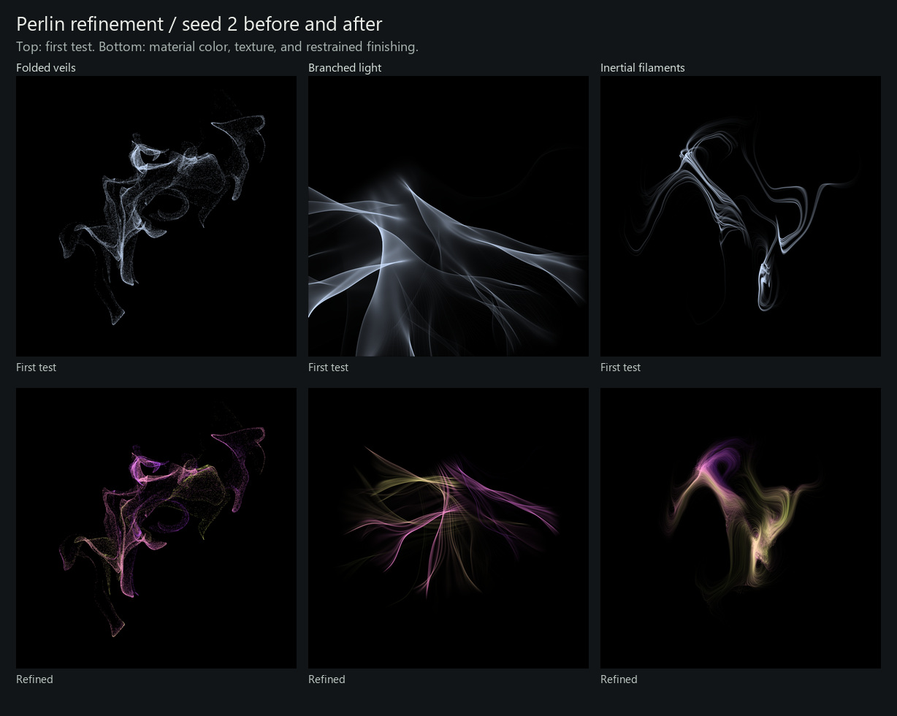

# Perlin studies: color and texture refinement

3 October 2026 · `agent/generator-experiments`

This pass follows the user's verdict: keep the folded veils, add color and
finer material to branched light, and give inertial filaments more texture over
larger areas. All three remain standalone experiments. The production generators
and mainline candidate are unchanged.



## What changed

**Folded veils:** the original particle motion, camera, and density deposits are
preserved. A Perlin pigment coordinate travels with each sheet particle, bringing
color variation into the folds. Finishing is deliberately restrained so the fine
edges and black openings survive.

**Branched light:** neighboring rays carry unequal radiance sampled from several
Perlin scales. This stretches fine internal striations along their paths. Advected
material supplies color, and the camera fits the actual trajectories, recovering
forms that previously missed the frame. Perlin forces are evaluated in overlapping
tiles wherever the rays travel, with matching gradients across tile boundaries.

**Inertial filaments:** wider, unequal particle curtains replace the small line
sources. Perlin changes source width and density; continuous response-time
variation stretches these areas into textured bodies with thin outskirts. Color
comes from source material and local speed. Particles approaching the finite
simulation boundary fade before they stop.

The shared finish uses a seeded related/complementary palette, density-dependent
pale highlights, modest local contrast, fine multiplicative Perlin modulation
within occupied pixels, and small highlight bloom. Empty space stays black away
from the finite glow around light. These choices adapt the originals' ideas:
[Perlin's direction/position color](../../../src/legacy/perlin.cpp),
[Fujii's motion-dependent color](../../../src/legacy/fujii.cpp), and
[Fractal's highlight bloom](../../../src/legacy/fractal.cpp).

## Compare all seeds

Each refined study retains seeds **1–24 at 768 × 768**. The saved first-test PNGs
are unchanged. The [local gallery](http://127.0.0.1:8766/) contains **192 images**:
72 refined, 72 first tests, and 48 original Perlin/Fujii and earlier attractor
references. Its default comparison is refined veils against the same first-test
seed. Grayscale compares form independently of hue.

| Study | Refined | First test |
| --- | --- | --- |
| Folded veils | [Color](seed-sheets/experiments-folded_veils.jpg) · [Gray](seed-sheets/experiments-folded_veils-gray.jpg) | [Sheet](seed-sheets/baseline-folded_veils.jpg) |
| Branched light | [Color](seed-sheets/experiments-branched_light.jpg) · [Gray](seed-sheets/experiments-branched_light-gray.jpg) | [Sheet](seed-sheets/baseline-branched_light.jpg) |
| Inertial filaments | [Color](seed-sheets/experiments-inertial_filaments.jpg) · [Gray](seed-sheets/experiments-inertial_filaments-gray.jpg) | [Sheet](seed-sheets/baseline-inertial_filaments.jpg) |

Veils 7, 11, 13, and 20 show useful color separation; 3 and 4 remain sparse or
dark. Branched light 1, 2, 4, and 23 have fine internal strands and clear seams;
11 is now fully framed, while 3 and 20 remain sparse. Several branched-light
seeds still separate into disconnected groups. Filaments 4, 10, 13, and 20 show broader texture and distinct openings;
1 and 19 are still narrow or small. The filaments' repeated nested curves remain
a recognizable constraint. These are provisional visual judgments, not a claim
that finishing has resolved every weak seed.

## Reproduce

See the [runbook](../../../experiments/README.md) for environment setup.

```powershell
python -m experiments.render --study perlin --seeds 1:24 --size 768 --jobs 3
python -m experiments.gallery --focus-perlin --publish-sheets docs/experiments/perlin-refinement/seed-sheets
python -m experiments.render --study perlin --seeds 1:4 --size 768 --control finish=0 --output build/experiments/unprocessed
python -W error -m unittest discover -s experiments/tests -v
```

`finish=0` disables color and finishing on the current geometry. It is distinct
from the historical first test at commit `5bc43b4`. The [run manifest](run-manifest.json)
records all final image hashes, shared-source hashes, palettes, timings, and
mechanism diagnostics. Tests cover exact replay, finishing-independent transport,
black preservation, curl structure, inertial response, and ray-force continuity.

All **49 tests passed** with warnings treated as errors. All 72 final renders
passed source/dependency/pixel-hash and strict metadata checks. The 72 preserved
baseline images also match their original pixel hashes. Veil geometry and density
diagnostics match the baseline across all 24 seeds; six paired probes additionally
compared the raw density arrays byte-for-byte. All final branched-light renders
record zero force samples outside an evaluated Perlin tile.
