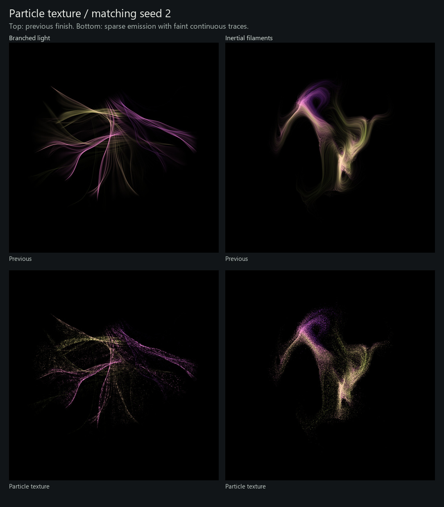

# Particle texture on black

3 October 2026 · `agent/generator-experiments`

The user approved the colored Folded Veils and found Branched Light and Inertial
Filaments too smooth. This pass changes only the latter two studies' emission
and bloom. The approved veil source, shared finishing code, and all 24 saved veil
images remain unchanged.



Branched Light now emits roughly 90,000 independent packets along its integrated
ray paths. A Perlin field in source-coordinate/travel-time space modulates their
radiance. Inertial Filaments sparsely emits material along its simulated paths;
source coordinates and travelled distance drive a Perlin emission probability.
Both compensate packet weights for thinning and retain a 12% continuous trace
underneath the grain. Reduced bloom helps the particles remain distinct.

The texture comes from actual deposits before rasterization. Particle motion,
camera framing, and the palette stay fixed. A new normalized `texture` control
defaults to 1; setting it to 0 reproduces the previous colored finish at commit
`030ce26`. The existing `finish` control independently disables the finishing.

## Compare every seed

The [local gallery](http://127.0.0.1:8766/) retains **240 images**, including all
24 new and 24 previous samples of each affected study, the approved veils, first
tests, original Perlin/Fujii references, and attractors. Its default comparison
shows new Branched Light against the same seed's previous finish. Full-resolution
PNGs and a grayscale toggle support closer inspection.

| Study | New particle texture | Previous finish |
| --- | --- | --- |
| Branched Light | [Color](seed-sheets/experiments-branched_light.jpg) · [Gray](seed-sheets/experiments-branched_light-gray.jpg) | [Color](seed-sheets/smooth-branched_light.jpg) · [Gray](seed-sheets/smooth-branched_light-gray.jpg) |
| Inertial Filaments | [Color](seed-sheets/experiments-inertial_filaments.jpg) · [Gray](seed-sheets/experiments-inertial_filaments-gray.jpg) | [Color](seed-sheets/smooth-inertial_filaments.jpg) · [Gray](seed-sheets/smooth-inertial_filaments-gray.jpg) |

The grain is substantially clearer in the paired probes. Branched Light 11
retains long blue/yellow creases; 4 remains busy and speckled. Filament 2 retains
its bright central folds and becomes porous across the broader body. The faintest
loops are less prominent than in smooth mode, even with the continuous trace.
The change does not resolve narrow compositions or repeated nested curves in
the underlying filament simulation. These are visual observations, separate
from numerical verification.

Across the complete sheets, Branched Light 3, 5, 12, 13 and 20 still separate
into small groups. Filament 1 and 19 remain narrow or small; 15 and 16 read as
broader granular clouds. Texture improves the material without changing these
composition limits.

## Reproduce and verify

```powershell
python -m experiments.render --study branched_light --seeds 1:24 --size 768 --jobs 3
python -m experiments.render --study inertial_filaments --seeds 1:24 --size 768 --jobs 3
python -m experiments.render --study branched_light --seeds 2 --size 768 --control texture=0 --output build/experiments/smooth-check
python -m experiments.gallery --focus-perlin
python -W error -m unittest discover -s experiments/tests -v
```

Preserve previous PNGs under `build/experiments/gallery/smooth/<study>/` before
rendering the new defaults. Historical sheets in the [first refinement review](../perlin-refinement/README.md)
are preserved. The [run manifest](run-manifest.json) records the new/previous pixel
hashes, source hashes, packet diagnostics and unchanged transport checks for all
48 new renders. Paired 768px probes additionally establish exact `texture=0`
replay of the previous finish for both studies. Mechanical tests cover seeded
replay, finite deposits, compensated light, resolution-independent motion and
texture-independent transport. They do not establish artistic quality.

All **51 tests passed** with warnings treated as errors. All 48 new renders
passed source, dependency and pixel-hash checks; their transport diagnostics
match the previous versions. The previous 48 pixels and all 24 approved veil
pixels match their saved hashes. Browser verification decoded all 240 thumbnails,
checked 262 image/sheet links and exercised same-seed comparisons and grayscale
without runtime errors.
