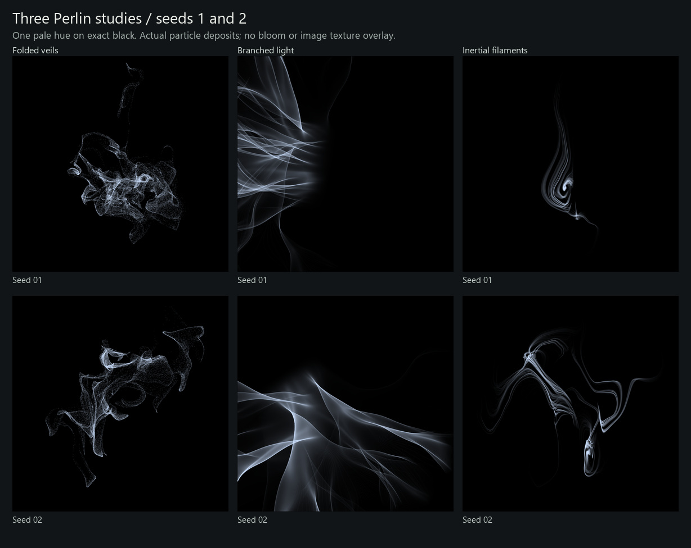

# Three minimal Perlin studies

3 October 2026 · `agent/generator-experiments`

The brief is thin, wispy forms and interesting deposited textures driven by
Perlin fields on stark black. These three standalone Python prototypes test
different transport mechanisms. Each has two controls and uses the same pale
tint `(205, 225, 255)`, with no bloom, blur, or image-space texture overlay.
The native application and mainline candidate PR remain unchanged.



**24 seeds per study, 768 × 768, all retained:** 72 new images. The
[local comparison gallery](http://127.0.0.1:8766/) includes 48 saved references:
12 original Perlin, 12 original Fujii, and 24 earlier attractor renders. It
supports full-resolution inspection, corresponding seed selection, and grayscale.
The originals retain their normal rendering conditions; this is an aesthetic
comparison, not a speed benchmark. Equal seed numbers do not imply equivalent
compositions. See the [earlier review](../README.md#what-was-compared) for reference
render conditions.

## What the prototypes show

| Study | Mechanism and controls | Complete seed sheets |
| --- | --- | --- |
| Folded veils | 76,000 particles in irregular sheets, transported through 3D Perlin curl flow and projected. Controls: folding time, fine flow strength. | [Color](seed-sheets/experiments-folded_veils.jpg) · [Gray](seed-sheets/experiments-folded_veils-gray.jpg) |
| Branched light | Rays retain momentum while a Perlin potential bends their paths; concentrations form caustics. Controls: refraction, travel distance. | [Color](seed-sheets/experiments-branched_light.jpg) · [Gray](seed-sheets/experiments-branched_light-gray.jpg) |
| Inertial filaments | Identically launched particle cohorts respond at different rates to evolving Perlin currents. Controls: inertia, fine currents. | [Color](seed-sheets/experiments-inertial_filaments.jpg) · [Gray](seed-sheets/experiments-inertial_filaments-gray.jpg) |

**Folded veils:** seeds 2, 7, 12, and 20 produce distinct translucent folds and
openings. Seeds 3 and 21 are comparatively sparse. This captures wispy surfaces,
but particle stippling remains visible and the material changes less than the
originals across seeds.

**Branched light:** seeds 2, 6, 16, and 21 have strong seams and intersections.
Seeds 11 and 20 mostly miss the frame; 13 becomes disconnected edge fragments.
Some variation comes from cropping, and broad beams recur. The mechanism works,
but composition and fine texture need development.

**Inertial filaments:** seeds 2, 7, 10, 13, and 20 have convincing movement and
negative space. Seeds 1 and 6 feel undersized. The repeated parallel strands can
look like fine wire; they need more variation within each form.

For comparison, [original Perlin](seed-sheets/originals-perlin.jpg) seeds 2, 4,
and 6 combine fine striations, bright seams, and dark openings. [Original
Fujii](seed-sheets/originals-fujii.jpg) seeds 2, 4, and 7 range from smooth
translucency to frayed complexity. The [earlier attractor
study](seed-sheets/experiments-attractors.jpg) remains the accepted direction from
the first round. These assessments are provisional visual judgments, with an
independent subagent review of branched light and inertial filaments.

## Reproduce and verify

Follow the [runbook](../../../experiments/README.md) for dependencies, then run:

```powershell
python -m experiments.render --study perlin --seeds 1:24 --size 768 --jobs 3
python -m experiments.gallery --focus-perlin --publish-sheets docs/experiments/perlin/seed-sheets
python -W error -m unittest discover -s experiments/tests -v
```

All **37 tests passed**, covering repeatability, Perlin continuity, light
accumulation, curl structure, ballistic control, and inertial response. All 72
renders passed source/dependency/pixel hash, finite metadata, exact-black, and
fixed-tint checks. The [run manifest](run-manifest.json) records the environment,
timings, hashes, and mechanism diagnostics. No images were discarded. These
checks verify implementation behavior; they do not establish artistic quality.
